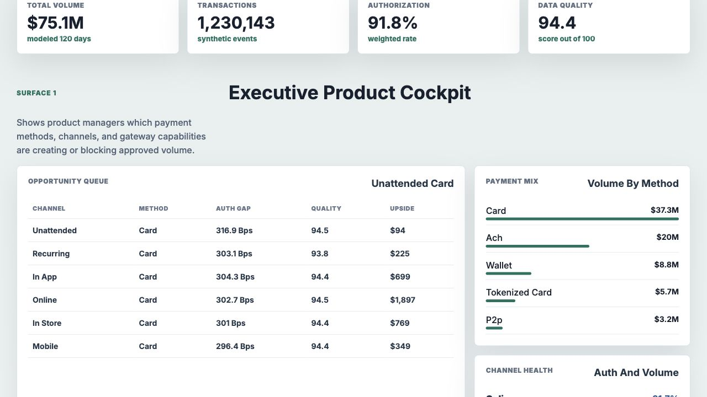
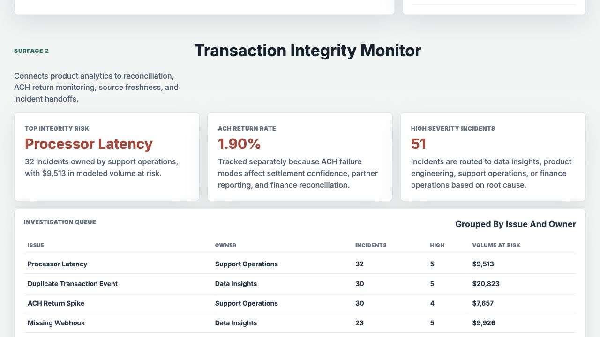
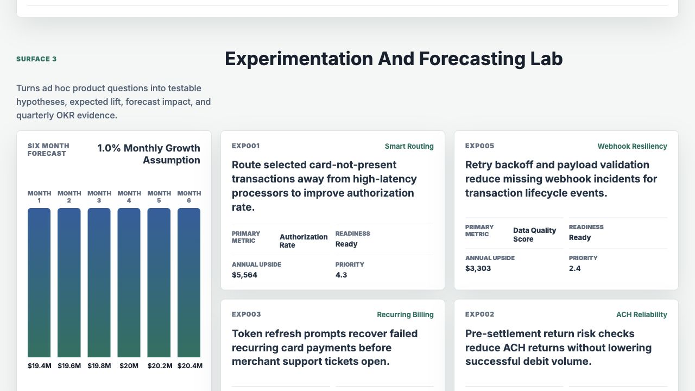

# Payment Gateway Product Intelligence Framework

An interactive portfolio artifact for a product data analyst role in embedded payments. It models how a payment gateway product team can connect transaction performance, reporting trust, reconciliation signals, and experimentation into one monthly operating workflow.

The artifact is designed for a multi-partner gateway platform where product managers need to understand adoption, authorization health, payment mix, settlement friction, ACH reliability, and roadmap upside across card, ACH, P2P, wallet, recurring, in-store, online, mobile, and unattended payment flows.

## Screenshots



The executive product cockpit ranks channel and payment method opportunities by authorization gap, data quality, settlement delay, reconciliation variance, and estimated revenue upside.



The transaction integrity monitor turns incidents, ACH returns, ledger variance, missing webhooks, duplicate events, and processor latency into an owner-based investigation queue.



The experimentation and forecasting lab connects product hypotheses to eligible volume, expected lift, readiness, six month volume forecast, and quarterly OKR evidence.

## What This Demonstrates

- Product KPI ownership for gateway performance, adoption, transaction volume, authorization rate, capture rate, and payment method mix.
- Data accuracy monitoring across webhook completeness, duplicate lifecycle events, reconciliation variance, settlement delay, and source data quality.
- Opportunity sizing and prioritization for product managers, engineering, support operations, finance operations, and data insights.
- Experimentation framework design for smart routing, ACH reliability, recurring billing recovery, reporting self service, and webhook resiliency.
- Interview-ready documentation for how synthetic data was generated, analyzed, and turned into stakeholder recommendations.

## Data

The project uses synthetic data because public transaction-level gateway data is not available and should not be fabricated as real. The generator lives in `scripts/generate_gateway_artifact.py` and uses a fixed random seed for reproducibility.

The synthetic data is modeled on common embedded payments operating structure:

- Eight partner portfolios across SaaS platform, ISO portfolio, PayFac program, bank referral, vertical software, marketplace, unattended operator, and healthcare billing motions.
- Six channels: online, in app, in store, mobile, unattended, and recurring.
- Five payment methods: card, ACH, P2P, wallet, and tokenized card.
- Four processor routes with different authorization, latency, settlement, and reconciliation profiles.
- 120 days of daily transaction metrics with weekday seasonality, channel mix, payment method mix, processor effects, ACH return behavior, recurring billing data quality issues, unattended device authorization pressure, and ACH settlement anomalies.
- Incident and reconciliation records generated from low data quality, ledger variance, processor latency, missing webhooks, duplicate transaction events, batch settlement delay, and ACH return spikes.

Generated source tables:

- `data/partners.csv`
- `data/transaction_daily.csv`
- `data/data_quality_incidents.csv`
- `data/reconciliation_checks.csv`
- `data/experiments.csv`

Generated analysis outputs:

- `analysis/outputs/kpi_summary.json`
- `analysis/outputs/opportunity_queue.csv`
- `analysis/outputs/integrity_queue.csv`
- `analysis/outputs/experiment_readiness.csv`
- `analysis/outputs/forecast_summary.csv`

## Analysis Logic

The generator calculates:

- Weighted authorization rate and data quality score by transaction count.
- Payment method and channel opportunity scores from authorization gap, reconciliation variance, settlement delay, quality penalty, and revenue upside.
- Incident risk scores from high severity count, incident frequency, and modeled volume at risk.
- Six month volume and revenue forecasts from the last 28 modeled days compared with the first 28 modeled days.
- Experiment priority from eligible volume, expected lift, confidence, and readiness.

## How To Run

```bash
npm run analyze
npm start
```

Open `http://localhost:4173`.

## Scope

This is a portfolio artifact, not a production payment system. It does not process payments, connect to live processors, or represent real company performance. It does show how a product data analyst could structure a defensible analytics framework for gateway product strategy, KPI transparency, data integrity investigation, reconciliation support, experimentation, forecasting, and recurring stakeholder review.
